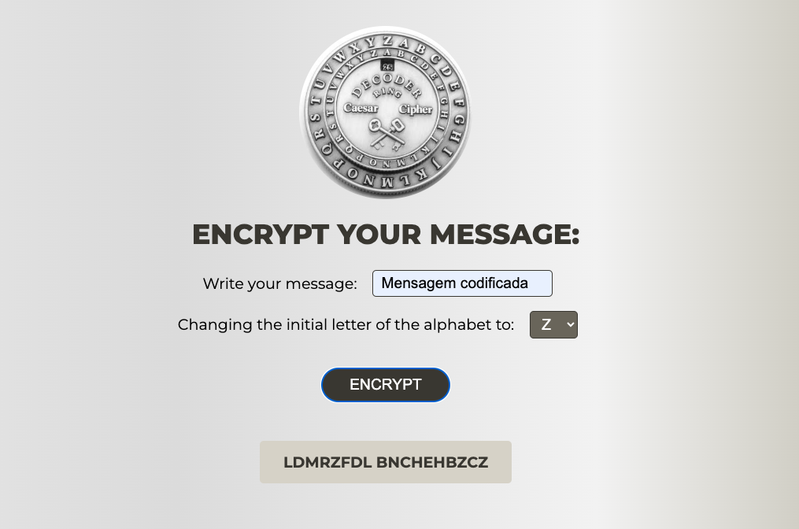

# Project Caesar Cipher
This project was created as a learning exercise during the Formação.DEV course.

It is a simplified implementation of the classic **Caesar Cipher**, focusing only on the **encryption process**.  

The application allows users to enter a message and shift value, generating the encrypted text based on the Caesar Cipher technique.

The main goal of this project was to practice **HTML, CSS, and JavaScript** by building a small, interactive web application.

</img>

## 🤔 What is this project
The Caesar Cipher is one of the oldest and simplest encryption techniques.  
In this project, I implemented only the **encryption** feature, where each letter of the input text is shifted by a given number of positions in the alphabet. 

## 🖥️ How to run the project
To run the project, simply double-click the *index.html* file once the project folder is open in your operating system's file system. 

Alternatively, you can also use the [Live Server](https://marketplace.visualstudio.com/items?itemName=ritwickdey.LiveServer) extension from the Visual Studio Code IDE to run the project.

## ⚙️ Tech stack

-------

Create with 🪄 by Fernanda Leite
